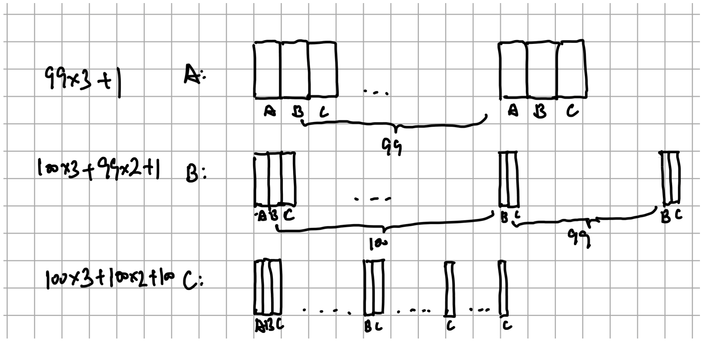

# Chapter 7 CPU Scheduling
**Q1:** Compute the response time and turnaround time when running three jobs of length 200 with the SJF and FIFO schedulers.
**ANS:** FIFO and SJF ***Turnaround Time*** and ***Response Time*** are the same: 
$T_{turnaround} = (200 + 400 + 600) / 3 = 400s$
$T_{response} = (0 + 200 + 400) / 3 = 200s$

**Q2:** Now do the same but with jobs of different lengths: 100, 200, and 300.
**ANS:** FIFO and SJF ***Turnaround Time*** and ***Response Time*** are the same: 
$T_{turnaround} = (100 + 300 + 600) / 3 = 333.3s$
$T_{response} = (0 + 100 + 300) / 3 = 133.3s$

**Q3:** Now do the same, but also with the RR scheduler and a time-slice of 1.
**ANS:** Here is the picture to calculate the turnaround time:

So, according to the picture, the turnaround time of RR scheduler is: 
$T_{turnaround} = (298 + 499 + 600) / 3 = 465.67s$
$T_{response} = (0 + 1 + 2) / 3 = 1s$

**Q4:** For what types of workloads does SJF deliver the same turnaround times as FIFO?
**ANS:** The length of jobs in increasing order

**Q5:** For what types of workloads and quantum lengths does SJF deliver the same response times as RR?
**ANS:** The first N-1 jobs lengths is equal to the RR time slices.

**Q6:** What happens to response time with SJF as job lengths increase? Can you use the simulator to demonstrate the trend?
**ANS:** The response time increases

**Q7:** What happens to response time with RR as quantum lengths increase? Can you write an equation that gives the worst-case response time, given N jobs?
**ANS:**  The response time increases, the formular is:  
$\sum_1^n min\{len(job_i), T_{timeslice}\}$

